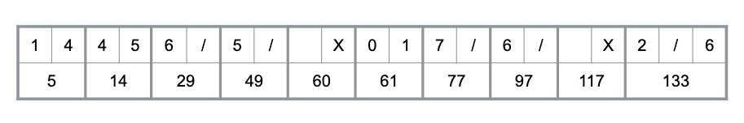

# Bowling game kata

17-04-2020

Remote Kata at GuideSmiths by Iñigo Marquinez and Nuria Extremadouro

## Team

- Ramon Morcillo
- Jose Manuel Torralvo

## Introduccion

Crearemos un motor básico para representar una partida de bolos
Resaltaremos la importancia del TDD:
Entender los casos de uso
Diseñar todos los tests que sean necesarios para verificar dichos casos
Desarrollar el código para cumplir con los tests

## Reglamento

- El juego consiste en 10 frames (cuadros o rondas)
- En un frame, el jugador tiene 2 rolls (lanzamientos) y puede tumbar hasta 10 bolos
- La puntuación del frame es el número de bolos tumbados
- Un strike (pleno) es cuando el jugador tumba los 10 bolos en el primer roll de un frame:
  - Si sucede, el jugador consigue 2 rolls extra que serían los del siguiente frame
  - La puntuación sería 10 más el número de bolos tumbados en los 2 rolls siguientes
- Un spare (semipleno) es cuando el jugador tumba los 10 bolos en el segundo roll del frame:
  - Si sucede, el jugador consigue 1 roll extra que sería el primer roll del siguiente frame
  - La puntuación sería 10 más el número de bolos tumbados en el siguiente roll
- En el décimo frame el jugador tiene permitido lanzar los rolls extra que consiga en ese mismo frame hasta un máximo de 3
- La puntuación total sólo puede ser calculada al final del juego

## Requisitos

- Debéis definir un objeto BowlingGame con estos mínimos:
  - Propiedad rolls: almacena la puntuación de cada frame
  - Método roll(pins): invocado cada vez que un roll (lanzamiento) es ejecutado en un frame. El parámetro pins es un entero con el número de bolos tumbados en ese roll
  - Método getScore(): calcula la puntuación total al final del juego
- Primero definid los tests siguiendo el reglamento
- Una vez tengáis los tests definidos (fallando) escribid el código hasta que pasen todo

## Videos

- [Presentation](https://docs.google.com/presentation/d/1yt7lpmiHGJqirCbRr9JfsVVPIYg5S2GXTDxPgHn9hVg/present?slide=id.p)
- [Introduction](https://youtu.be/6vWKSjv76hU)
- Solutions:
  - [Part 1](https://www.youtube.com/watch?v=KcXIH2Sl_1w)
  - [Part 2](https://www.youtube.com/watch?v=jI3847tbfHE)
